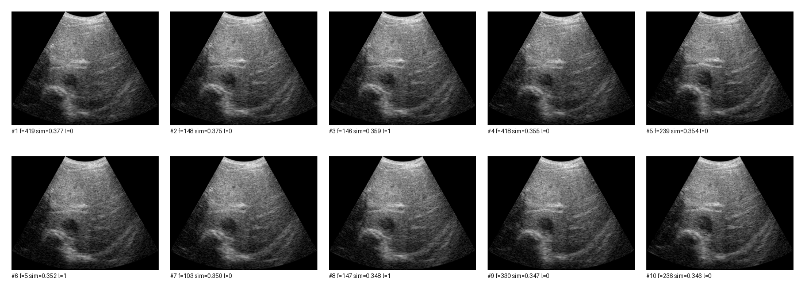

# 発表スライド原稿（詳細版）

発表日: 2026-01-27（予定）

---

## Slide 1: タイトル
**超音波計測における安定タイミング検出のための自己教師あり表現学習とランキング最適化**
- 発表者: AI Playground プロジェクト
- 所属: 富山大学 工学部 知能情報工学科
- 年度: 令和 7 年度

---

## Slide 2: 研究背景
- ハイパーサーミア治療では温度測定の精度が治療効果に直結
- 呼吸や体動により超音波プローブ位置が揺らぎ、計測値のばらつきが発生
- 超音波画像はノイズが多く、安定タイミングの目視判定が困難

**課題**: 主観的判断に依存しない、客観的な安定区間抽出が必要

---

## Slide 3: 先行研究
- 医用画像検索 (MIR) は前処理・特徴抽出・類似度計算の段階的構成が一般的
- 従来手法は手工特徴や分類器由来特徴に依存し、視覚的類似性の捉え方に限界
- Siamese 系ネットワークや TripletLoss によるメトリック学習が発展
- 医用画像はラベルコストが高く、教師なし・自己教師あり学習の需要が大きい
- Weng ら (2025): SimSiam による Siamese/デュアルエンコーダで特徴抽出 → 教師なしメトリック学習（量子化）で表現を洗練、ISIC2019 で視覚類似性を改善し超音波/MRI/CT へ転移

**スライド用文章（読み上げ想定）**:
先行研究では、**何を**「視覚的に似た医用画像を検索すること（MIR）」、**どんな手法で**「特徴抽出＋類似度学習」で解くかが焦点でした。代表例として Weng ら (2025) は、**皮膚病変画像の類似検索**を目的に、**SimSiam による Siamese/デュアルエンコーダ**で特徴量を学習し、続いて**量子化ベースの教師なしメトリック学習**で特徴空間を整える二段階構成を採用しています（ISIC2019 の視覚類似ラベルを再構成）。その結果、視覚類似性の評価が改善し、超音波/MRI/CT など他モダリティへの転移可能性も示しました。  
本研究では、**自己教師ありで特徴を学び、後段で検索性能を最適化するという流れ**を取り入れ、後段を **FastAP** でランキング指標（mAP）に合わせて最適化する点が先行研究との差分です。

---

## Slide 4: 研究目的
- 超音波フレーム列から安定区間を自動抽出
- 参照画像（息止め画像など）に近いフレームを高速検索
- 自己教師あり表現学習 + ランキング最適化の統合

---

## Slide 5: 本研究の貢献
1. 自己教師あり表現学習とランキング最適化を統合した画像検索型枠組みの提示
2. 前処理・擬似ラベル・評価手順の整理（フレーム単位と時間的安定性の両立）
3. 学習エポック数と外部クエリ評価から埋め込み分布変化の影響を示唆

---

## Slide 6: データ概要
- データ形式: MAT v7.3 (HDF5)
- 形状: `(445, 256, 3319)`
  - フレーム数: 445
  - ラテラル: 256
  - 深さ: 3319 サンプル
- 物理座標: 深さ・ラテラル・時間

---

## Slide 7: 前処理（B-mode 変換）
- ログ圧縮でダイナミックレンジを整える
- クリップ: -60 dB ～ 0 dB
- [0,1] 正規化

**式**:
\[
I(x,z)=20\log_{10}\left(\frac{|A(x,z)|}{A_m}\right),\quad
I_n(x,z)=\frac{I_c(x,z)+60}{60}
\]

---

## Slide 8: 前処理（縦横比補正）
- 物理スケール比: \( r = d_z / d_x \)
- 深さ方向を \( r \) 倍にリサイズ

**式**:
\[
I'(x,z)=I_n(x,rz)
\]

---

## Slide 9: 前処理（擬似ラベル生成）
- 連続フレーム差分 → 移動平均で平滑化
- 下位 20 パーセンタイルを安定候補
- 連続長 3 未満は陰性へ戻す

**式**:
\[
 s_t=\frac{1}{|\Omega|}\sum_{x,z}|I_n^t-I_n^{t-1}|,
\quad s_t^s=\frac{1}{L}\sum_{i=-2}^2 s_{t+i}
\]

---

## Slide 10: 前処理結果（図）
**B-mode 正規化後の参照画像例**

---

## Slide 11: 擬似ラベル分布（表）

| 項目 | 枚数 | 比率 |
|---|---:|---:|
| 全フレーム | 445 | 100% |
| 陽性（安定） | 87 | 19.6% |
| 陰性 | 358 | 80.4% |

---

## Slide 12: 自己教師あり表現学習（SimSiam）
- ResNet-18 をバックボーン
- 2-view のコサイン類似度を最大化
- 片側の勾配停止で崩壊を防止

**式**:
\[
L=-\frac{1}{2}(p_1^T z_2 + p_2^T z_1)
\]

---

## Slide 13: 学習設定
- エポック: 10 / 100
- バッチサイズ: 128
- 最適化: SGD (momentum 0.9, weight decay 1e-4)
- 学習率: 0.05 + CosineAnnealing
- 画像拡張: RandomResizedCrop, HorizontalFlip, ColorJitter, Grayscale, Blur

---

## Slide 14: 代替手法（DINO v2 + TripletLoss）
- DINO v2 で特徴抽出
- TripletLoss で距離学習
- SimSiam との差分比較用ベースライン

---

## Slide 15: SimSiam 損失推移（図）

- 10 エポック最終損失: -0.8246
- 100 エポック最終損失: -0.9326
- 長期学習で損失改善だが性能との乖離に注意

---

## Slide 16: ランキング最適化（FastAP）
- 平均適合率を滑らかに近似
- ランキング指標と学習目的を一致

**学習条件**:
- 10 エポック, バッチ 64
- AdamW, num_bins=100, sigma=0.05

---

## Slide 17: 評価指標
- mAP, Precision@K, Recall@K
- 区間評価: IoU, 区間 Precision/Recall

**式**:
\[
P_K(q)=\frac{1}{K}\sum_{k=1}^K r_q(k),\quad
R_K(q)=\frac{1}{N_q^+}\sum_{k=1}^K r_q(k)
\]

---

## Slide 18: 指標比較（表）

| 指標 | 実験 A (2025-11-05) | 実験 B (2025-10-30) | 備考 |
|---|---:|---:|---|
| mAP | 0.7290 | 0.7463 | B は再現設定 |
| Precision@1 | 0.8022 | N/A | B は未記録 |
| Precision@5 | 0.7910 | N/A | B は未記録 |
| Precision@10 | 0.7818 | N/A | B は未記録 |
| Recall@10 | 0.0291 | N/A | B は未記録 |

---

## Slide 19: 内部クエリ Top-10
- Top-10 中 5 件が陽性
- 類似度が 0.97 以上に集中

---

## Slide 20: 外部クエリ Top-10（図）

- Top-10 全て陰性
- 外部クエリで性能低下

---

## Slide 21: 検索速度・学習時間
- 検索: 0.146 秒 / クエリ
- SimSiam 100 エポック: 約 53 分
- FastAP 10 エポック: 約 4.6 分

---

## Slide 22: 考察
- 損失低下は検索性能に直結せず、クエリ間ばらつきが残る
- 類似度が高値に集中し順位差が小さく、外部クエリで性能低下
- 擬似ラベルの偏りが評価に影響 → 高信頼フレームの再ラベルが必要
- mAP だけでなく Precision@K / Top-K など複数指標で確認

---

## Slide 23: 結論
- 自己教師あり表現学習 + ランキング最適化で安定タイミング検出を改善
- mAP 約 0.73、Top-10 陽性率向上、検索速度 0.146 秒
- 外部クエリ性能低下が課題

---

## Slide 24: 今後の課題
- 外部クエリ周辺の再ラベルと複数参照画像の導入
- 分布監視と早期停止による汎化低下の抑制
- FastAP パラメータ調整と Top-K 評価の拡張

---

## Slide 25: 参考文献
1. Chen, X., & He, K., "Exploring Simple Siamese Representation Learning," CVPR, 2021.
2. Cakir, F., et al., "Deep Metric Learning to Rank," CVPR, 2019. (FastAP)
3. Oquab, M., et al., "DINOv2: Learning Robust Visual Features without Supervision," 2023.
4. Weng, X., Zhuang, Y., Wang, R., Chen, K., Han, L., Hua, Z., Lin, J., "Unsupervised visual similarity-based medical image retrieval via dual-encoder and metric learning," Neurocomputing, 2025.
